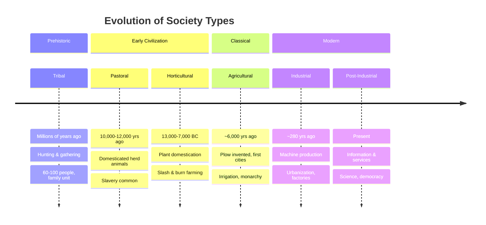
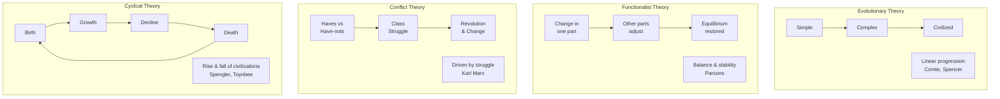

# Chapter 1: History of Engineering Practices

**Subject:** Engineering Professional Practice (CE 752) | **Semester:** VIII | **IOE, Tribhuvan University**

**Syllabus Coverage:**
1.1 Man and Society
1.2 Technology and Society
1.3 History of Engineering Practice in Eastern Society
1.4 History of Engineering Practice in Western Society
1.5 Engineering Practices in Nepal

**Hours:** 3 | **Marks:** 4

```markmap
---
markmap:
  initialExpandLevel: 3
---
# Ch1: History of Engineering Practices
## 1.1 Man and Society
### What is Society?
- Latin: Socius = companionship
- Web of social relationships
- Abstract, dynamic, permanent
### 4 Criteria
- Population
- Common Territory
- Government
- Common Culture
### 10 Characteristics
- Plurality of Individuals
- Mutual Interaction & Awareness
- Likeness and Difference
- Interdependence
- Cooperation and Conflict
- Permanence and Stability
- Dynamic Nature
- Abstract Nature
- Social Control
- Culture
### Community
- Concrete, location-specific
- 8 Elements
  - Group of People
  - Definite Locality
  - We-feeling
  - Cultural Similarity
  - Permanency
  - Naturality
  - No Legal Status
  - Particular Name
### 3 Theories of Origin
- Divine Origin (God created)
- Social Contract (Hobbes, Locke, Rousseau)
- Evolutionary (Spencer, Darwin)
### 6 Types of Society
- Tribal (hunting/gathering)
- Pastoral (herd animals)
- Horticultural (manual farming)
- Agricultural (plow, cities)
- Industrial (machines, factories)
- Post-Industrial (information, services)
### 5 Social Institutions
- Family
- Religion
- Economy
- Education
- State
### 6 Social Needs (Parsons)
- Organizing activities
- Protection
- Replacement of members
- Transmission of knowledge
- Motivation
- Conflict resolution
### Social Change
#### 8 Factors
- Technological
- Cultural
- Environmental
- Demographic
- Economic
- Social Conflict
- Social Movements
- Human Ideas
#### 4 Theories
- Evolutionary (Comte, Spencer)
  - Simple → Complex, linear
- Functionalist (Parsons)
  - Equilibrium, parts adjust
- Conflict (Marx)
  - Class struggle drives change
  - Primitive → Slavery → Feudal → Capitalist → Communist
- Cyclical (Spengler, Toynbee)
  - Birth → Growth → Decline → Death
### Individual Freedom vs. Societal Goals
- Conflict: Self-interest vs. collective good
- Balance
  - Social Control (laws, norms)
  - Ethics and professional codes
  - Synergy (innovation serves society)
### Role of Engineers
- Why society matters
  - Source of problems
  - Understanding users/context
  - Impact assessment
- 5 Key Roles
  - Problem Solver
  - Innovator
  - Visionary and Planner
  - Guardian of Safety
  - Agent of Economic Growth
### Eastern vs. Western Values
- Eastern: Collectivism, harmony, spirituality, tradition
- Western: Individualism, progress, rationality, efficiency
## 1.2 Technology and Society
### Definition
- Practical application of scientific knowledge
- Reciprocal relationship with society
### 9 Impacts on Society
- Mass production
- Automation
- Faster transportation
- Mass communication (Global Village)
- Labor-saving devices
- Faster pace of life
- Commercializing recreation
- High specialization
- Healthcare advancement
### Impact on Social Systems
- Family → Nuclear, women in workforce
- Religion → Caste rigidity vanished
- Rural Life → Urban migration
- Urban Life → Slums, crime, congestion
### ICT and Society
- Economic development (e-commerce)
- Employment (new jobs + displacement)
- Social interaction (Global Village)
- Education (distance learning)
- Privacy concerns
### 6 Impacts of Computers
- Social applications
- Employment & productivity
- Competition
- Individuality
- Quality of life
- Privacy
### Computer Crime
- Types: Hacking, piracy, identity theft, viruses, fraud, DoS
- Protection: Antivirus, cyber law, Electronic Transaction Act 2063
## 1.3 Eastern Society
### Key Civilizations
- China
  - Great Wall (220 BC)
  - Grand Canal (510 AD)
  - 4 Inventions: Compass, Gunpowder, Paper, Printing
  - Seismoscope (Chang Heng, 132 AD)
- India
  - Indus Valley (2500-1700 BC)
  - Grid cities, drainage, metallurgy
- Mesopotamia
  - Irrigation (Tigris-Euphrates)
  - Ziggurats, Cuneiform writing
- Persia
  - Ctesiphon Palace (400 AD)
  - Bridges (Shapur-I, 300 AD)
- Nepal
  - Araniko (13th C, White Stupa Beijing)
  - Pagoda architecture
- Korea/Japan
  - Block printing (704 AD)
  - First anesthesia surgery (1805)
## 1.4 Western Society
### Ancient Civilizations
- Egypt: Pyramids (2700-2500 BC)
- Greece: Parthenon (447 BC), Archimedes
- Rome: Roads, Aqueducts, Concrete
### Industrial Revolution Milestones
- 1698: Steam engine (Savery)
- 1761: First civil engineer (Smeaton)
- 1863: First PhD in Engineering (Gibbs)
- 1903: First flight (Wright Brothers)
- 1950+: Computers, Space, Internet
### Spread of Knowledge
- Trade routes
- Natural barriers
- Hydraulic State concept
## 1.5 Engineering in Nepal
### Historical Timeline
- Vedic: Vaastu engineering
- Kirat/Licchavi: Temples, Hiti system
- 13th C: Araniko (White Stupa)
- 1850: First iron bridge
- 1911: Pharping Hydropower
- 1965-72: IOE established
### Key Figures
- Araniko (13th C, architect)
- Gehendra Shumsher (1871-1906, First Scientist)
- Shanti Malla (first lady engineer)
- Kul Ratna Tuladhar (first Dean IOE)
### Rural Development Focus
- Micro-hydro
- Trail bridges and ropeways
- Green roads
- Agricultural technology
- Earthquake-resistant construction
## Past Questions
### Society & Community
- Characteristics/elements of society [2074, 2072, 2079]
  - 10 traits: plurality, interdependence, social control, culture
  - Abstract web of relationships; dynamic yet permanent
  - Cooperation & conflict coexist; likeness & difference
- Criteria of society [2074]
  - Population, common territory, government, common culture
  - Shared culture with sense of membership/commitment
- Difference: society vs community [2080]
  - Society: abstract web; Community: concrete, location-specific
  - Society wider/heterogeneous; Community smaller/homogeneous
  - Community needs "we-feeling"; society does not
- Types of society [2079]
  - 6 types: tribal → pastoral → horticultural → agricultural
  - Industrial (machines, factories, urbanization)
  - Post-industrial (information, services, democracy)
### Social Needs & Institutions
- Fundamental social needs (Parsons) [2073, 2071]
  - Organizing activities, protection, replacement of members
  - Knowledge transmission, motivation, conflict resolution
### Social Change
- Factors causing social change [2081, 2072]
  - 8 factors: technological, cultural, environmental, demographic
  - Economic, social conflict, social movements, human ideas
- Theories of social change [2081]
  - Evolutionary (Comte/Spencer): simple → complex linear
  - Conflict (Marx): class struggle drives change
  - Functionalist (Parsons) equilibrium; Cyclical (Spengler) rise-fall
- Conflict theory + relevance in Nepal [2078]
  - Marx: haves vs have-nots class struggle
  - Nepal: Maoist insurgency, monarchy → republic transition
  - Caste/ethnic tensions drove political transformation
- Suitable theory for Nepal [2075]
  - Conflict theory most suitable for Nepal
  - Jana Andolan, Maoist insurgency = class struggle
  - Functionalist partly applies (urbanization → nuclear families)
- Role of technology in social change [2072]
  - Most powerful agent of social change
  - Mass production, communication revolution, automation
  - Transformed family, agriculture, healthcare, urbanization
### Individual vs Society
- Individual freedom vs societal goals [2073]
  - Self-interest clashes with collective welfare needs
  - Balanced by social control, ethics, professional codes
  - Synergy: individual innovation serves society's benefit
- Why conflict exists [2070]
  - Self-interest vs collective good; resource scarcity
  - Diverse values; what one considers freedom violates another
  - Professional: employer cost-cutting vs safety standards
### Role of Engineers
- Engineers in society [2078, 2070, 2073]
  - 5 roles: problem solver, innovator, visionary/planner
  - Guardian of safety, agent of economic growth
  - Society provides problems; engineers build for people
- Engineers in social change [2080]
  - Introduce technology changing how people live
  - Infrastructure development connects remote areas
  - Knowledge transfer and cleaner technology adoption
### Technology & Society
- Impact of technology [2079, 2071]
  - 9 impacts: mass production, automation, communication
  - Healthcare advancement, labor-saving, specialization
  - Changed family, religion, rural and urban life
- ICT and society [2079]
  - E-commerce, automation, new job creation
  - Distance learning, global village connectivity
  - Privacy concerns, cybercrimes, job displacement
- Technology and society [2079, 2073]
  - Reciprocal relationship: they shape each other
  - Mass communication created "Global Village"
  - Faster transportation, specialization, healthcare advances
- Impact of computers [2073, 2072]
  - 6 areas: social apps, employment, competition
  - Individuality, quality of life, privacy concerns
  - Nepal: e-governance, digital banking, online learning
- Digital technology + economic development [2077]
  - E-commerce/banking (Daraz, eSewa, Khalti)
  - New jobs: developers, data analysts, digital marketing
  - Distance learning, access to global markets
- Computer crimes [2072]
  - Hacking, piracy, identity theft, viruses, fraud
  - Protection: antivirus, cyber law enforcement
  - Nepal: Electronic Transaction Act 2063
### History
- Eastern society contributions [2082]
  - China: Great Wall, 4 inventions, Grand Canal
  - India: Indus Valley grid cities, drainage, metallurgy
  - Mesopotamia: irrigation, ziggurats; Nepal: Araniko's White Stupa
- Engineering practice in Nepal [2071]
  - Araniko (13th C), Gehendra Shumsher (first scientist)
  - Pharping Hydropower 1911, IOE established 1965
  - Vedic vaastu → temples → modern engineering education
- Lessons from history [2079]
  - Build for durability; use appropriate local technology
  - Community involvement; environmental responsibility
  - Continuous learning; prioritize ethics and safety
- Rural infrastructure technology [2078]
  - Micro-hydro, trail bridges, ropeways for connectivity
  - Green roads: labor-intensive, environmentally friendly
  - Agricultural mechanization, earthquake-resistant construction
```

---

## 1.1 Man and Society

### What is Society?

Society is derived from the Latin word _socius_ meaning companionship, friendship, or comrade. In sociology, society refers to a large group of individuals united by certain relations, modes of behavior, and a web of social relationships. It is not a mere collection of people but a complex pattern of norms and interactions that arise among them. Society is abstract, meaning we cannot "see" it, only observe the relationships and patterns within it.

**Definitions by scholars:**

| Scholar             | Definition                                                                                                                                                                               |
| ------------------- | ---------------------------------------------------------------------------------------------------------------------------------------------------------------------------------------- |
| **MacIver**         | "The system of usages and procedures, of authority and mutual aid, of many groupings and divisions of controls of human behaviors and liberties. It is the web of social relationship."  |
| **Morris Ginsberg** | "A collection of individuals united by certain relations or mode of behavior which mark them off from others who do not enter into these relations or who differ from them in behavior." |
| **J.F. Cuber**      | "A group of individuals who have lived together long enough to become organized and consider themselves distinct from others."                                                           |
| **Cooley**          | "A complex of forms or processes each of which is living and growing by interaction with the others, the whole being so unified that what takes place in one part affects all the rest." |

### Criteria of Society

A society must have:

1. **Population**: Can be small or big.
2. **Common Territory**: People occupy a shared geographic area.
3. **Government/Political Authority**: Common political authority.
4. **Common Culture**: Shared culture and a sense of relationship, membership, and commitment to the group.

### Characteristics (Elements) of Society **[Frequently Asked]**

1. **Plurality of Individuals**: Composed of people of different ages, sexes, economic statuses, and cultural backgrounds.
2. **Web of Social Relationships / Mutual Interaction and Awareness**: The core element. Defined roles (father, teacher, engineer) and reciprocal interactions.
3. **Likeness and Difference**: Likeness (blood relation, nationality) binds people. Difference (interest, opinion, gender, ability) enables division of labor and mutual dependence.
4. **Interdependence**: No individual is self-sufficient. Members depend on each other for biological and social needs.
5. **Cooperation and Conflict**: Cooperation (working together for common goals) holds society together. Conflict (disagreement, competition) drives change. Both coexist in a healthy society.
6. **Permanence and Stability**: Society outlives individual members. Organized on the basis of division of labor.
7. **Dynamic Nature**: Changeability is inherent. No society remains static.
8. **Abstract Nature**: Society is intangible. It is the web of social relationships, not the people themselves.
9. **Social Control**: Society controls member behavior through customs, traditions, laws, and institutions.
10. **Culture**: Every society has its own unique way of life, traditions, values, and attitudes.

#### Solved Past Questions

**Q: Write down in brief the Characteristics Features of Society. What are the elements of Community. [2074 Bhadra] [5 marks]**

→ Fully covered above. List the 10 Characteristics of Society and 8 Elements of Community from the sections above.

---

**Q: Explain criteria of society. [2074 Magh] [4 marks]**

→ Fully covered in "Criteria of Society" section above. Elaborate each of the 4 criteria (Population, Common Territory, Government, Common Culture) with one-line explanation each.

---

**Q: Define society. Illustrate elements of society. Describe the relationship between man and society. [2072 Magh]**

→ For definition and elements: refer to "What is Society?" and "Characteristics (Elements) of Society" sections above.

**Relationship between Man and Society** (unique angle): Man is a social animal and cannot live in isolation. The relationship is reciprocal: man forms society by developing norms, standards, and traditions; society in turn controls human behavior through customs, laws, culture, and discipline. Neither can exist without the other.

---

**Q: Define Society. Explain briefly about the types of society in the sociological point of view. [2079 Shrawan] [4 marks]**

→ Write definition from "What is Society?" section, then list the 6 Types of Society from the table above (Tribal → Pastoral → Horticultural → Agricultural → Industrial → Post-Industrial) with one-line description each.

### What is Community?

A community is a social group whose members reside in a specific locality, share government, and have a common cultural and historical heritage. Unlike society (which is abstract), a community is concrete and location-specific.

**Definition by MacIver**: "Whenever the members of any group, small or large, live together in such a way that they share, not this or that particular interest, but the basic conditions of a common life, we call that group community."

**Elements of Community:**

1. Group of People
2. Definite Locality/Territory
3. Community Sentiment (We-feeling)
4. Cultural Similarity (Likeness)
5. Permanency
6. Naturality (grows spontaneously, not created by law)
7. No Legal Status
8. Particular Name

### Difference Between Society and Community

| Basis      | Society                             | Community                                     |
| ---------- | ----------------------------------- | --------------------------------------------- |
| Definition | Web of social relationships         | Group of people living in a specific locality |
| Geography  | No definite geographic area         | Definite locality is essential                |
| Nature     | Abstract (network of relationships) | Concrete (visible group in a place)           |
| Sentiment  | Community sentiment not essential   | "We-feeling" is indispensable                 |
| Scope      | Wider and more comprehensive        | Smaller and more specific                     |
| Character  | Heterogeneous                       | Homogeneous                                   |
| Formation  | Society came prior to community     | Community came after society                  |

### Theories of Origin of Society

1. **Divine Origin Theory**: Society was created by God. Human activities are governed by divine will. Rooted in religious philosophies (e.g., Sanatan Hindu philosophy of Brahma).

2. **Social Contract Theory** (Thomas Hobbes, Locke, Rousseau): Humans were born free but lived in a chaotic "state of nature." To gain security and order, individuals voluntarily made an agreement (contract) to form society and abide by rules.

3. **Evolutionary Theory** (Herbert Spencer, based on Darwin): Society was not made intentionally but evolved gradually from simple to complex forms. Kinship and family were the earliest bonds. Society progressed from Savage → Barbarian → Civilized. The most scientifically accepted view.

### Types of Society



| Type                | Timeframe               | Main Feature                                                    |
| ------------------- | ----------------------- | --------------------------------------------------------------- |
| **Tribal**          | Millions of years ago   | Hunting and gathering. 60-100 people. Family is main unit.      |
| **Pastoral**        | 10,000-12,000 years ago | Domesticated herd animals. Larger populations. Slavery common.  |
| **Horticultural**   | 13,000-7,000 BC         | Domestication of plants. Slash and burn. Division of labor.     |
| **Agricultural**    | 6,000 years ago         | Plow invented. First cities. Irrigation. Monarchy.              |
| **Industrial**      | 280 years ago           | Machine production. Urbanization. Factory system. Trade unions. |
| **Post-Industrial** | Present                 | Information and service economy. Science, education, democracy. |

### Social Institutions

Five basic institutions found in all known societies:

1. **The Family**: Contributes new members, teaches expected behaviors.
2. **Religion**: Motivates members to comply with responsibilities and obligations.
3. **Economy**: Produces and distributes goods and services.
4. **Education**: Transmits skills needed for productive membership.
5. **The State**: Protects members from external and internal threats. Establishes legal codes.

### Fundamental Social Needs (Talcott Parsons) **[Frequently Asked]**

1. **Organizing Activities**: Obtain basic goods and services (food, clothing, shelter).
2. **Protection**: From external threats (invasion, disasters) and internal threats (crime, epidemics).
3. **Replacement**: Replace members lost by death or emigration.
4. **Transmission of Knowledge**: Teach new members rights, obligations, and expected behaviors.
5. **Motivation**: Motivate members to fulfill responsibilities.
6. **Conflict Resolution**: Develop mechanisms for solving conflicts.

#### Solved Past Questions

**Q: What are the major activities to be governed by the society for its survival? [2073 Bhadra] [4 marks]**

→ Fully covered in "Fundamental Social Needs (Talcott Parsons)" section above. List and elaborate the 6 needs: Organizing, Protection, Replacement, Transmission, Motivation, Conflict Resolution.

---

**Q: Define society. What are the fundamental social needs to be addressed for the survival of every type of societies? [2071 Magh] [4 marks]**

→ Write definition from "What is Society?" section, then list 6 Fundamental Social Needs (Parsons) from the section above.

### Social Change **[Frequently Asked]**

Social change refers to alterations in social structure, cultural patterns, and social behaviors over time. It is a dynamic process. Society is never static. Changes occur in social institutions, social roles, and social values.

**Definition by MacIver**: "Social change in the human relationship."
**M.P. Jenison**: "Social change may be defined as modification in ways of doing and thinking of people."

**Major Factors Causing Social Change:**

1. **Technological Factors**: The most powerful agent of change. Inventions (wheel, steam engine, internet) alter how we live and work.
2. **Cultural Factors**: New ideas, ideologies, values. Spread of democracy, secularism, or new religious movements.
3. **Physical/Environmental Factors**: Natural calamities (earthquakes, floods), climate change.
4. **Demographic Factors**: Changes in population size, birth rates, death rates, migration.
5. **Economic Factors**: Industrialization, capitalism, shift from agriculture to manufacturing.
6. **Social Conflict**: Division based on class, religion, gender, caste causes social changes.
7. **Social Movements**: Organized efforts by groups to change values, norms, culture.
8. **Human Actions, Ideas and Opinions**: Evolution of new ideas modifies social structures.

### Theories of Social Change **[Frequently Asked]**



**A. Evolutionary Theory (Socio-Cultural Evolution)**

Based on Darwin's biological evolution. Society moves linearly from simple to complex, primitive to civilized.

Key proponents: Auguste Comte, Herbert Spencer.

Example: Human civilization evolved from Hunting/Gathering → Agrarian → Industrial → Information Society.

**B. Functionalist Theory (Equilibrium Theory)**

Society is a system of interconnected parts (family, education, economy) that work together to maintain balance. Change in one part forces adjustment in others to restore equilibrium.

Key proponent: Talcott Parsons.

Example: When women entered the workforce (economic change), family structure adapted (nuclear families, daycare), and education changed accordingly.

**C. Conflict Theory (Marxist Theory)** **[Frequently Asked]**

Change is driven by conflict between competing groups over limited resources. Society is a struggle between the "Haves" (Bourgeoisie) and "Have-nots" (Proletariat).

Key proponent: Karl Marx.

Economic basis: Society evolves as Primitive communism → Slavery → Feudal → Capitalist → Proletariat/Communist.

**Relevance to Nepal**: The Maoist insurgency and the transition from Monarchy to Republic were driven by class conflict, ethnic tensions, and the struggle for resource distribution. Change did not happen smoothly (Evolutionary) but through struggle (Conflict).

**D. Cyclical Theory**

Society acts like a biological organism: birth, maturity, old age, death. Civilizations rise and fall in cycles.

Key proponents: Spengler, Toynbee.

Example: Rise and fall of the Roman Empire, dynastic cycles in China/Nepal.

#### Solved Past Questions

**Q: Define social change. What are the major factors bringing changes in society? [2081 Chaitra] [4 marks]**

→ Fully covered in "Social Change" section above. Write definition (MacIver/Jenison), then list the 8 factors causing social change.

---

**Q: List down and explain the various theories of social change with example. [2081 Shrawan] [4 marks]**

→ Fully covered in "Theories of Social Change" section above. Write all 4 theories (Evolutionary, Functionalist, Conflict, Cyclical) with proponent names and one example each.

---

**Q: Explain the conflict theory of social change and its relevance in Nepal. [2078 Kartik] [4 marks]**

→ For Conflict Theory basics: refer to "Theories of Social Change → C. Conflict Theory" section above.

**Relevance to Nepal** (expand these points):

- **Maoist Insurgency (1996-2006)**: Class struggle where rural poor, lower castes, ethnic minorities fought the ruling elite for equal rights.
- **Monarchy to Republic (2008)**: 240-year monarchy abolished through political struggle, not gradual evolution.
- **Caste/Ethnic Tensions**: Upper-caste resource control → movements for Dalit, Janajati, Madhesi inclusion.
- Conclusion: Change in Nepal came through struggle, making Conflict Theory highly relevant.

---

**Q: Explain what type of Social change theory is suitable for your society. [2075 Bhadra] [4 marks]**

→ For theory definitions: refer to "Theories of Social Change" section above.

**How to write**: Argue **Conflict Theory** is most suitable for Nepal — major changes (Jana Andolan, Maoist insurgency, caste struggles, land reform) came through struggle, not smooth evolution. Acknowledge **Functionalist Theory** also partly applies (urbanization → nuclear families, education system adapting to technical/vocational training).

---

**Q: What is social change? What are the factors causing social change? Describe the role of technology in social change. [2072 Ashwin] [8 marks]**

→ For social change definition and 8 factors: refer to "Social Change" section above.

**Role of Technology in Social Change** (unique angle for this question):
Technology is the most powerful driver of social change. Its impacts include:

- **Mass Production**: Machines created the factory system and a new working class, leading to urbanization.
- **Communication Revolution**: Telegraph → telephone → internet made the world a "Global Village."
- **Transportation**: Steam engines, cars, airplanes connected distant places, enabling trade, migration, and cultural exchange.
- **Automation**: Computers and robots increased productivity but caused job displacement.
- **Agriculture**: Mechanized farming enabled rural-to-urban shift.
- **Healthcare**: Vaccines, imaging, surgery increased life expectancy.
- **Family System**: Led to nuclear families, women's workforce participation, changed traditional values.
- **Rural-Urban Shift**: Improved urban life but also caused slums, crime, pollution.

### Individual Freedom vs. Societal Goals

Every individual desires absolute freedom while society requires order, stability, and collective welfare.

**Why conflict exists:**

- Personal desires clash with collective rules (e.g., an engineer wants cheap construction for profit but society demands safety standards).

**How it is balanced:**

1. **Social Control**: Laws, ethics, and norms limit absolute freedom for the greater good (the "Social Contract").
2. **Role of Ethics**: Engineering ethics teaches professionals to prioritize public welfare over personal gain.
3. **Synergy**: Individual freedom to innovate creates technology that helps society.

"Your liberty to swing your fist ends just where my nose begins."

#### Solved Past Questions

**Q: Explain how individual freedom balances societal goals. [2073 Bhadra] [4 marks]**

→ Fully covered in "Individual Freedom vs. Societal Goals" section above. Elaborate the 3 mechanisms: Social Control (laws/norms), Ethics and Professional Codes, and Synergy. Add Democratic Governance as 4th point for 4 marks.

---

**Q: Why the conflict exists between an individual's freedom and the social goal? [2070 Magh] [5 marks]**

→ For basics and balancing mechanisms: refer to "Individual Freedom vs. Societal Goals" section above.

**Unique angle — Why the conflict exists** (expand these for 5 marks):

1. **Self-interest vs. Collective Good**: Individuals pursue personal gains; society demands sharing and rule-following.
2. **Resource Scarcity**: Limited resources → individual acquisition clashes with fair distribution.
3. **Diverse Values**: What one person considers freedom (e.g., loud construction at night) violates another's rights.
4. **Professional Context**: Employer pressure to cut costs vs. professional ethics demanding safety standards.

### Role of Engineers in Society **[Frequently Asked]**

**Why is society important for engineers?**

- Society provides the problems engineers solve (client needs).
- Engineers build for people, so understanding social norms and culture is needed.
- Engineering projects have massive social impacts (displacement, pollution).

**Key roles of an engineer:**

1. **Problem Solver**: Identify societal problems (traffic, water scarcity) and provide technical solutions.
2. **Innovator**: Introduce new technologies (renewable energy) that change how society functions.
3. **Visionary and Planner**: Visualize future infrastructure and create roadmaps.
4. **Guardian of Safety**: Ensure structures and products are safe for public use.
5. **Agent of Economic Growth**: Build infrastructure (roads, power plants) that drives the economy.

**Role in developmental activities:**

1. Creating vision
2. Preparing mission
3. Execution
4. Monitor and evaluate
5. Train new engineers

**Changes brought by engineers:**

- Mass production of goods through machines
- Automation
- Faster means of transportation
- Mass communication
- Labor-saving devices
- Faster pace of life
- Commercializing recreation
- High degree of specialization

#### Solved Past Questions

**Q: Explain why society is important for engineers? What are the key roles that an engineers plays in the society? [2078 Chaitra] [4 marks]**

→ Fully covered in "Role of Engineers in Society" section above. Write the 3 reasons why society is important for engineers + 5 key roles.

---

**Q: Why is society necessary for engineers? What are the roles that an engineer can play in the society? [2070 Bhadra] [5 marks]**

→ Same as above. Write the 3 reasons + 5 key roles from "Role of Engineers in Society" section. For 5 marks, add **Trainer** (trains the next generation of engineers and technical workers) as a 6th role.

---

**Q: Why are men and society so important to engineering profession? [2073 Magh] [4 marks]**

→ Related to "Role of Engineers in Society" section above, but asks from the opposite angle (why man/society matter TO engineering).

**How to write** — frame as a chain:

1. Man forms society → social relationships create needs (shelter, food, transport, communication).
2. Society creates demand → every engineering project serves people's needs.
3. Society provides resources → materials, labor, money, knowledge that no individual alone can gather.
4. Engineers serve society → professional duty to "hold paramount public safety, health, and welfare."
5. Social impact → every project affects society (dam provides electricity but may displace communities), so understanding people is essential.

---

**Q: Define the term society and community. Explain in brief the role of engineers in Social Change. [2080 Chaitra] [4 marks]**

→ For society and community definitions: refer to "What is Society?" and "What is Community?" sections above.

**Role of Engineers in Social Change** (unique content):

1. **Technology Introduction**: Engineers bring new technologies that change how people live (e.g., internet in Nepal changed communication, education, business).
2. **Infrastructure Development**: Roads, bridges, power plants connect remote areas, changing rural lifestyles.
3. **Innovation**: Engineers innovate solutions (e.g., earthquake-resistant construction after 2015) that change building practices.
4. **Knowledge Transfer**: Engineers train local communities in new skills, changing employment patterns.
5. **Environmental Impact**: Engineers introduce cleaner technologies (solar, hydropower), shifting society away from polluting practices.

### Eastern vs. Western Values of Society

| Eastern Values                          | Western Values              |
| --------------------------------------- | --------------------------- |
| Social harmony                          | Achievement and success     |
| Sacrifice for group welfare             | Activity and work           |
| Truth and integrity                     | Moral orientation           |
| Respect for elders, teachers, ancestors | Efficiency and practicality |
| Maintaining culture/tradition           | Progress                    |
| Helping people in need (Paropakar)      | Material comfort            |
| Purity in thought and acts              | Equality and Freedom        |
| Religious/spiritual achievement         | Individualistic orientation |
| Collectivism                            | Use of technology           |
| Holistic worldview                      | Science and rationality     |

**Key differences**: Individualism vs. Collectivism, Fragmentation vs. Holistic, Conflict vs. Harmony, Idealism vs. Pragmatism.

---

## 1.2 Technology and Society

### What is Technology?

Technology is the proper knowledge and use of tools and techniques that facilitates the transfer of inputs into outputs efficiently. It is the practical application of scientific knowledge to create tools and systems that solve human problems. The relationship between technology and society is reciprocal: they shape each other.

**Technological change** is defined as the modification and alteration of current tools and techniques to bring improvement in society and improve productivity.

### Impact of Technology on Society **[Frequently Asked]**

**Major impacts:**

1. **Mass production of goods** through machines
2. **Automation** of processes
3. **Faster means of transportation** (steam engines, cars, planes, global connectivity)
4. **Mass communication** (telegraph, telephone, internet, "Global Village")
5. **Labor-saving devices**
6. **Faster pace of life**
7. **Commercializing recreation**
8. **High degree of specialization**
9. **Healthcare**: Vaccines, surgery, imaging, increased life expectancy

**Technology change and specific social systems:**

| Area           | Impact                                                                                                                        |
| -------------- | ----------------------------------------------------------------------------------------------------------------------------- |
| **Family**     | Nuclear families, women's participation, change in living standards, mechanical lifestyle, formal relations, less family ties |
| **Religion**   | Analysis of religious doctrines, caste rigidity vanished, religion becomes secondary                                          |
| **Rural Life** | Urban migration, increased consciousness, comfortable life, change in life pattern                                            |
| **Urban Life** | Shortage of land/houses, increased slums, transportation problems, increased crime, money becomes paramount, lack of security |

#### Solved Past Questions

**Q: Describe about the impact of technology into the society and explain the relationship between human and society. [2079 Chaitra] [5 marks]**

→ For 9 technology impacts: refer to "Impact of Technology on Society" section above.

**Relationship between Human and Society** (unique content):
Humans and society are inseparable. Man is a social animal (Aristotle). The relationship is reciprocal:

- **Society shapes the individual**: Culture, language, values, education, and norms are learned from society.
- **Individuals shape society**: New ideas, inventions, leadership, and movements by individuals change society (e.g., inventors like Edison, leaders like Gandhi).
- Society provides basic needs (food, shelter, security) and individuals contribute labor, skills, and knowledge.
- The relationship operates through social institutions: family (socialization), education (knowledge), economy (livelihood), government (order), and religion (values).

---

**Q: Write short notes on: Technology and society. [2079 Shrawan / 2073 Magh] [2-2.5 marks]**

→ Covered in "Impact of Technology on Society" section above. Write definition of technology, mention reciprocal relationship, then list 4-5 key impacts from the 9 listed above.

---

**Q: Discuss on the impact of technology into the society. [2071 Bhadra] [4 marks]**

→ Fully covered in "Impact of Technology on Society" section above. List all 9 impacts with one-line explanation each. Mention negative side-effects (pollution, privacy, urban problems) if space permits.

---

**Q: How does digital technology help our society in economic development? [2077 Chaitra] [2 marks]**

→ Partially related to "ICT and Society" section above but focuses specifically on economic angle.

**Key points**: E-commerce/banking (Daraz, eSewa, Khalti), automation increasing productivity, new job creation (developers, data analysts, digital marketers), distance learning for skill development, access to global markets for Nepali businesses.

### ICT and Society

Information Communication Technology (ICT) has transformed how society functions:

- **Economic Development**: Automation in banking, e-commerce (Daraz, eSewa), increased efficiency and transparency.
- **Employment**: Creates new jobs (programmers, data analysts) but also replaces manual jobs ("technological unemployment").
- **Social Interaction**: Keeps people connected (video calls, social media, "global village") but reduces face-to-face skills.
- **Education**: Distance learning, access to global knowledge.
- **Privacy**: Rise of cybercrimes, loss of data privacy.

### Impact of Computers on Society **[Frequently Asked]**

1. **Social Applications**: Medical diagnosis, computer-assisted instruction, government planning, environmental quality control, law enforcement (CCTV).
2. **Employment and Productivity**: Increment in job opportunities but also loss of jobs due to automation.
3. **Competition**: Large institutions gain competitive advantage, small firms may struggle.
4. **Individuality**: Reduced human relationships, inflexibility.
5. **Quality of Life**: Better quality goods/services at low cost, increased leisure, eliminated monotonous tasks.
6. **Privacy**: Easy to collect, store, interchange, and retrieve data, but privacy is lost.

#### Solved Past Questions

**Q: What are the major activities to be governed by the society for its survival? Illustrate the impacts of computer on Nepalese society. [2073 Bhadra] [4 marks]**

→ For 6 social needs: refer to "Fundamental Social Needs (Talcott Parsons)" section above.

**Impacts of Computers on Nepalese Society** (unique content):

1. **Government Services**: E-governance (Nagarik App, online passport, land records digitization) improved transparency.
2. **Banking/Finance**: Digital banking (eSewa, Khalti, mobile banking) reached rural areas without physical banks.
3. **Education**: Online learning, Zoom classes (post-COVID), access to global resources.
4. **Employment**: IT sector created new jobs (developers, BPO) but reduced some manual jobs.
5. **Social Connection**: Nepalis abroad stay connected via video calls and social media.
6. **Privacy Concerns**: Rising cybercrimes, online fraud, data theft.

---

**Q: Write short notes on: Impact of computers in society. [2072 Ashwin] [2 marks]**

→ Fully covered in "Impact of Computers on Society" section above. List the 6 areas: Social Applications, Employment & Productivity, Competition, Individuality, Quality of Life, Privacy.

---

**Q: Write short notes on: Society and Information Communication Technology (ICT). [2079 Chaitra] [2.5 marks]**

→ Fully covered in "ICT and Society" section above. Define ICT, then list the 5 impact areas (Economic Development, Employment, Social Interaction, Education, Privacy) with Nepal examples (Daraz, eSewa).

### Computer Crime

Computer crime is the use of computers to perform criminal activities.

**Types:**

1. Unauthorized use, access, modification and destruction of hardware/software/data
2. Unauthorized release of information, software copying (piracy)
3. Denying end-user access to their own resources
4. Illegally obtaining information or tangible property
5. Money theft, bank fraud
6. Computer viruses (designed for specific malicious purposes, not biological)
7. Data alteration, program damage, data destruction
8. Malicious access, violation of privacy

**Protection measures:**

- Anti-spam legislation (CAN-SPAM Act 2003)
- Antivirus software
- Cyber Law (governs pornography, cyber stalking, scam, online fraud, software piracy)
- Nepal: Electronic Transaction Act 2061, Rules 2064

#### Solved Past Questions

**Q: Write short notes on: Computer crimes. [2072 Magh] [2 marks]**

→ Fully covered in "Computer Crime" section above. Define computer crime, list common types (hacking, piracy, identity theft, virus, online fraud, DoS), and mention protection measures + Nepal's Electronic Transaction Act 2063.

### Greatest Technological Achievements of the 20th Century

Electrification, Automobile, Airplane, Safe Water, Electronics, Radio/Television, Agricultural Mechanization, Computers, Telephone, Air Conditioning, Interstate Highways, Space Exploration, Internet, Imaging Technologies, Household Appliances, Health Technologies, Petroleum/Gas Technologies, Laser/Fiber Optics, Nuclear Technology, High Performance Materials.

---

## 1.3 History of Engineering Practice in Eastern Society

### Overview

Engineering practice in the East is characterized by collectivism, religious values, and community-driven projects. Four of the oldest civilizations developed in Asia: Egypt, Ancient China, Ancient India (Indus Valley), and Mesopotamia.

### Major Engineering Achievements (Timeline)

| Period           | Achievement                                                                                                  | Location              |
| ---------------- | ------------------------------------------------------------------------------------------------------------ | --------------------- |
| **5000 BC**      | Civilization at Yanshao (Neolithic culture along Yellow River). Earthen pottery and stone tools.             | China                 |
| **4000 BC**      | Cities planned in grid pattern with intersecting streets at right angles.                                    | China                 |
| **3500-3000 BC** | Towns and cities appear. Production and distribution through trade.                                          | Sumeria (Mesopotamia) |
| **3300-3200 BC** | Division of labor developed among merchants and metal workers.                                               | Egypt/Sumeria         |
| **3100 BC**      | Egyptian Civilization along Nile River.                                                                      | Egypt                 |
| **2700-2500 BC** | Pyramids of Egypt.                                                                                           | Egypt                 |
| **2500-1700 BC** | Indus Valley Civilization (Harappa, Mohenjo-daro). Urban grid system, sanitation, metallurgy.                | India/Pakistan        |
| **447-438 BC**   | Parthenon, Ancient Greece.                                                                                   | Greece                |
| **312 BC**       | Appian Way (Roman road).                                                                                     | Rome                  |
| **220 BC**       | Great Wall of China (General Meng Tien, Emperor Shih Huang).                                                 | China                 |
| **132 AD**       | Seismoscope invented by Chang Heng.                                                                          | China                 |
| **300 AD**       | Bridges built by Iranians (Shapur-I).                                                                        | Iran (Persia)         |
| **400 AD**       | Sassanid palace at Ctesiphon. Widest single span vault of unreinforced brickwork (77 ft wide, 112 ft high).  | Iraq                  |
| **510 AD**       | Grand Canal (Shan-Yang) connecting Yangtze and Yellow River.                                                 | China                 |
| **515 BC**       | Persian building method with stone introduced into India when Darius conquered Punjab.                       | Persia/India          |
| **704 AD**       | Buddhist text "Dharani Sutra" printed using block-printing technique in Korea. Oldest existing printed book. | Korea                 |
| **805 AD**       | Forerunners of guns invented ("fire lance").                                                                 | China                 |
| **1040 AD**      | First known gunpowder formula published by Tseng Kung-Liang.                                                 | China                 |
| **1045-1048 AD** | Pi-Sheng invented movable type printing (centuries before Gutenberg).                                        | China                 |
| **1250 AD**      | True guns with gunpowder chamber appeared. Reached Europe within a century.                                  | China                 |
| **1805 AD**      | Habaoka Seishu performed first surgery under general anesthesia.                                             | Japan                 |

### Ancient China (The Innovators)

- **Great Wall of China (220 BC)**: Massive defensive fortification. Advanced logistics, surveying, and masonry.
- **Grand Canal (510 AD)**: Longest canal in the world, connecting Yellow River and Yangtze. Lifeline for grain transport.
- **Four Great Inventions**: Compass (navigation), Gunpowder (warfare), Papermaking (knowledge transmission), Printing with Movable Type (before Gutenberg).
- **Other**: Silk, noodles, porcelain, paper money (from 3000 BC).

### Ancient India and Nepal

- **Indus Valley Civilization (2500-1700 BC)**: First known grid city system, advanced drainage/sanitation, flush toilets, public baths (The Great Bath), copper and bronze metallurgy.
- **Vedic / Ancient Nepal**: Pagoda style architecture, Vaastu engineering (Nalanda, Takshashila).
- **Araniko (13th Century)**: Master architect from Nepal who built the White Stupa in Beijing, showcasing Nepali bronze and stone craftsmanship.

### Mesopotamia (Cradle of Civilization)

- First large-scale irrigation systems (canals, dikes) between Tigris and Euphrates rivers.
- Ziggurats: Massive stepped pyramids of mud bricks (e.g., Ziggurat of Ur).
- Cuneiform writing on clay tablets for construction and trade records.
- Babylonian Gugallu (irrigation inspectors).

### Ancient Persia (Iran)

- Many bridges from the time of Shapur-I (300 AD).
- Sassanid palace at Ctesiphon (400 AD) with the widest single span vault of unreinforced brickwork.
- Stone building methods introduced into India (515 BC).

#### Solved Past Questions

**Q: Discuss the significant contributions of eastern societies to the field of engineering. Provide specific examples of their engineering achievements. [2082 Shrawan] [4 marks]**

→ Fully covered in Section 1.3 above. Pick achievements from Ancient China (Great Wall, Grand Canal, 4 Great Inventions, Seismoscope), Indus Valley (grid cities, sanitation), Mesopotamia (irrigation, ziggurats), Persia (Ctesiphon vault), and Nepal (Araniko). Include dates.

---

## 1.4 History of Engineering Practice in Western Society

### Overview

Western engineering is characterized by individualism, scientific rationalism, efficiency, progress, and material comfort. Engineering knowledge spread along trade routes and was shaped by natural barriers.

### Ancient Egypt

- **Pyramids of Giza (2700-2500 BC)**: Feats of structural engineering, logistics, and surveying using simple tools (lever, inclined plane). Oldest of the Seven Wonders.

### Ancient Greece

- Focus on geometry, logic, and aesthetics.
- **Parthenon (447-438 BC)**: Use of columns and beams.
- **Archimedes**: Screw pump, laws of buoyancy, application of mathematics to engineering.

### Ancient Rome (The Great Builders)

- **Roads**: 50,000 miles of durable roads. "All roads lead to Rome." Appian Way (312 BC).
- **Aqueducts**: Transported water over huge distances using gravity and arches (e.g., Pont du Gard).
- **Concrete**: Invented volcanic ash concrete (Pozzolana), enabling domes like the Pantheon.

### Industrial Revolution and Beyond (Timeline)

| Period           | Key Developments                                                                                                                                     |
| ---------------- | ---------------------------------------------------------------------------------------------------------------------------------------------------- |
| **1547-1752**    | Benjamin Franklin theorized lightning as electricity.                                                                                                |
| **1548-1620**    | Simon Stevin discovered triangle of forces (Netherlands).                                                                                            |
| **1564-1642**    | Beginning of stress analysis in beams (Galileo era).                                                                                                 |
| **1698**         | Thomas Savery invented first steam engine.                                                                                                           |
| **1700-1800**    | Industrial Revolution begins in Europe. James Watt patents steam engine. Society of Engineers formed in London. First cast-iron building in England. |
| **1761**         | John Smeaton, the first proclaimed Civil Engineer (English).                                                                                         |
| **1800**         | William Gilbert, first Electrical Engineer (De Magnete on Electricity). First engineering school in France.                                          |
| **1800-1825**    | Machine automation (France). First railroad locomotive. Chemical symbols developed. Single wire telegraph.                                           |
| **1825-1875**    | Reinforced concrete first used. First synthetic plastic. Bessemer steel process. First oil well (Pennsylvania). Typewriter perfected.                |
| **1863**         | William Gibbs (Yale University), first PhD in Engineering.                                                                                           |
| **1875-1900**    | Telephone (Alexander Graham Bell). Light bulb and phonograph (Thomas Edison). Gasoline engine (Gottlieb Daimler). Automobile (Karl Benz).            |
| **1900-1925**    | Wright Brothers' first flight (1903). Ford diesel tractors. First commercial flight (Paris-London).                                                  |
| **1925-1950**    | Television (John Logie Baird). VW Beetle. First atomic bomb. Transistor invented.                                                                    |
| **1950-1975**    | Computers introduced. Sputnik I (USSR). Telstar communication satellite. Moon landing (USA).                                                         |
| **1975-1990**    | Concorde supersonic flight. Columbia space shuttle. First artificial heart.                                                                          |
| **1990-Present** | Mars robots. Channel Tunnel. GPS technology.                                                                                                         |

### The First Engineers

The first engineers were irrigators, architects, and military engineers, often the same people. As agricultural surpluses grew, specialists emerged. Wealth accumulated and projects became too large for a single craftsman, giving rise to a new class: technicians and engineers who could negotiate with rulers, plan details, and direct workmen.

### Spread of Engineering Knowledge

- Inventions spread along trade routes and to lands where they could be applied.
- Natural barriers (deserts, oceans) stopped the spread.
- Large interconnected populations meant faster invention rates.
- "Hydraulic State" concept: Large irrigation projects necessitated centralized government (Nile, Tigris-Euphrates, Indus, Hwang-Ho valleys).

#### Solved Past Questions

**Q: From the History of engineering profession, what lessons the freshly graduated Engineers would learn. [2079 Jestha] [5 marks]**

Studying the history of engineering provides several important lessons for fresh graduates:

1. **Build for Durability and Sustainability**: Ancient structures like the Pyramids (4500+ years old), the Great Wall of China, and Roman roads survived for centuries because they were built with quality materials and careful planning. Lesson: Prioritize long-term durability over short-term cost savings.

2. **Contextual Solutions (Appropriate Technology)**: Ancient engineers designed solutions suited to their local environment, materials, and culture. The Indus Valley used local bricks; Nepal used timber and stone for pagodas. Lesson: What works in developed countries may not suit Nepal. Use locally available resources and appropriate technology.

3. **Community Involvement and Teamwork**: Historical mega-projects (pyramids, canals, irrigation systems) involved massive community participation. No single person built them alone. Lesson: Engineering is a team effort. Involve local communities in projects for acceptance and sustainability.

4. **Environmental Responsibility**: Civilizations that mismanaged their environment collapsed. Deforestation, soil erosion, and water mismanagement destroyed several ancient societies. Lesson: Engineers must consider environmental impact and practice sustainable development.

5. **Continuous Learning and Innovation**: Engineering has always evolved. From stone tools to computers, each generation built upon previous knowledge. Lesson: Never stop learning. Stay updated with new technologies and methods.

6. **Ethics and Public Safety**: Throughout history, engineering failures (bridge collapses, dam failures) caused loss of life when safety was ignored. Lesson: Always prioritize public safety and follow professional ethics and codes of practice.

7. **Nepal-Specific Lesson**: Nepal has a rich engineering heritage (Araniko, Gehendra Shumsher, pagoda architecture). Fresh graduates should study and preserve this heritage while adapting modern technology to Nepal's unique terrain and needs.

---

## 1.5 Engineering Practices in Nepal

### Historical Timeline

| Period/Year               | Development                                                                                                                                                                                      |
| ------------------------- | ------------------------------------------------------------------------------------------------------------------------------------------------------------------------------------------------ |
| **Vedic Period**          | Vaastu engineering (Nalanda, Takshashila).                                                                                                                                                       |
| **Kirat/Licchavi Period** | Construction of temples (Changunarayan), water spouts (Hiti), palaces using brick and timber.                                                                                                    |
| **13th Century**          | Araniko, master architect, built White Stupa in Beijing.                                                                                                                                         |
| **Malla Period**          | Temples, buildings, handicrafts.                                                                                                                                                                 |
| **1850**                  | First iron bridge over Bagmati River.                                                                                                                                                            |
| **1888-1895**             | Water supply system in Kathmandu.                                                                                                                                                                |
| **Rana Period**           | Bir Shumsher's son Gehendra Shumsher (1871-1906) manufactured rifles, cannons, and steam engines locally. Known as "First Scientist of Nepal." Sent 5 people to Japan for engineering education. |
| **1911**                  | Pharping Hydropower (Asia's second hydropower project).                                                                                                                                          |
| **1942**                  | Technical school established.                                                                                                                                                                    |
| **1959**                  | Overseer Institute established.                                                                                                                                                                  |
| **1965-1972**             | IOE (Institute of Engineering) established with German cooperation.                                                                                                                              |
| **1996**                  | Master's program started.                                                                                                                                                                        |
| **1998**                  | Computer engineering program started.                                                                                                                                                            |

**Key figures:**

- **Araniko (13th Century)**: Nepali architect who built White Stupa in Beijing.
- **Gehendra Shumsher (1871-1906)**: "First Scientist of Nepal." Manufactured rifles, cannons, and steam engines.
- **Shanti Malla**: First lady engineer of Nepal.
- **Kul Ratna Tuladhar**: First Dean of IOE.

### Technology Focus for Nepal's Rural Development

Given Nepal's rugged terrain and developing economy, engineers should focus on:

1. **Hydropower and Micro-Hydro**: Utilizing abundant water resources for remote electrification.
2. **Trail Bridges and Ropeways**: Critical for connectivity in mountains where roads are expensive and environmentally damaging.
3. **Green Roads**: Labor-intensive, environmentally friendly road building. Employs local people, minimizes landslides.
4. **Agricultural Technology**: Mechanization for terrace farming, irrigation systems (drip/sprinkler).
5. **Earthquake-Resistant Technology**: Retrofitting traditional houses with seismic bands. Critical given Nepal's seismic vulnerability.

#### Solved Past Questions

**Q: Discuss about the engineering practice in Nepal. [2071 Bhadra] [4 marks]**

→ Fully covered in Section 1.5 above. Write the historical timeline (Vedic Period → Kirat/Licchavi → Araniko → Malla → Rana/Gehendra Shumsher → Modern milestones: Pharping 1911, IOE 1965) and mention current practice areas.

---

**Q: In your opinion, what types of technology/ies Nepal should focus on, to develop the rural infrastructure rapidly. [2078 Kartik] [4 marks]**

→ Fully covered in "Technology Focus for Nepal's Rural Development" section above. Elaborate the 5 technologies: Hydropower/Micro-Hydro, Trail Bridges/Ropeways, Green Roads, Agricultural Technology, Earthquake-Resistant Construction.

---

## Quick Reference: Key Facts

| Fact                        | Detail                                                                             |
| --------------------------- | ---------------------------------------------------------------------------------- |
| Society (Latin)             | _Socius_ = companionship/friendship                                                |
| 4 Criteria of Society       | Population, Common Territory, Government, Common Culture                           |
| 6 Social Needs (Parsons)    | Organizing, Protection, Replacement, Transmission, Motivation, Conflict Resolution |
| 5 Social Institutions       | Family, Religion, Economy, Education, State                                        |
| 6 Types of Society          | Tribal → Pastoral → Horticultural → Agricultural → Industrial → Post-Industrial    |
| 4 Theories of Social Change | Evolutionary, Functionalist, Conflict (Marx), Cyclical                             |
| Conflict Theory (Marx)      | Primitive communism → Slavery → Feudal → Capitalist → Proletariat                  |
| China's 4 Great Inventions  | Compass, Gunpowder, Papermaking, Printing (Movable Type)                           |
| First civil engineer        | John Smeaton (1761, English)                                                       |
| First steam engine          | Thomas Savery (1698)                                                               |
| First flight                | Wright Brothers (1903)                                                             |
| Pharping Hydro (Nepal)      | 1911, Asia's second hydropower project                                             |
| Gehendra Shumsher           | 1871-1906, "First Scientist of Nepal"                                              |
| Araniko                     | 13th Century, Nepali architect, White Stupa in Beijing                             |
| IOE established             | 1965-1972, German cooperation                                                      |
| Seismoscope                 | Chang Heng, 132 AD, China                                                          |
| Grand Canal                 | 510 AD, China, longest canal in world                                              |
| Movable type printing       | Pi-Sheng, 1045 AD, China                                                           |
| Indus Valley                | 2500-1700 BC, first grid city, sanitation                                          |
| Pyramids of Giza            | 2700-2500 BC, Egypt                                                                |
| Appian Way                  | 312 BC, Rome                                                                       |
| Great Wall of China         | 220 BC                                                                             |

---

## Past Question Solutions Guide

### Frequency Summary

| Topic                                                  | Times Asked | Typical Marks |
| ------------------------------------------------------ | ----------- | ------------- |
| Define society / characteristics / elements / criteria | 7+          | 4-5           |
| Social change (definition + factors + theories)        | 6+          | 4-8           |
| Technology and society / impact of technology          | 6+          | 2-4           |
| Role of engineers in society                           | 4+          | 4-5           |
| Impact of computers on society                         | 3+          | 2-4           |
| Types of society                                       | 3+          | 2-4           |
| Community (definition + elements)                      | 3+          | 2-5           |
| Individual freedom vs. societal goals                  | 2           | 4-5           |
| Contributions of eastern societies                     | 2           | 4             |
| Engineering practice in Nepal                          | 2           | 4             |
| Lessons for fresh graduates from history               | 1           | 5             |
| Computer crimes                                        | 1           | 2             |
| Technology focus for Nepal                             | 1           | 4             |

Question patterns are placed inline within their relevant theory sections above.

---

## Exam Preparation Summary

### Top 10 Most Important Topics (by frequency)

1. **Definition and characteristics/elements of society** (asked almost every year)
2. **Social change: definition, factors, and theories** (asked every year)
3. **Technology and society / impact of technology** (asked every year)
4. **Role of engineers in society** (frequently asked)
5. **Impact of computers on society** (3+ times)
6. **Types of society** (3+ times)
7. **Community definition and elements** (often paired with society)
8. **Theories of social change** (especially Conflict Theory in Nepal's context)
9. **Eastern society contributions** (with specific examples)
10. **Engineering practices in Nepal** (timeline from Vedic to modern)

### Key Points to Memorize

- The 10 characteristics of society
- 6 fundamental social needs (Talcott Parsons)
- 4 theories of social change with proponents and examples
- 8 factors causing social change
- Society vs. Community comparison table
- At least 5-6 Eastern engineering achievements with dates
- Key Nepal engineering milestones (Araniko, Gehendra Shumsher, Pharping 1911, IOE)
- 6 impacts of computers on society

### Common Mistakes to Avoid

- Confusing society (abstract, web of relationships) with community (concrete, location-specific).
- Mixing up Evolutionary Theory (linear progress) with Cyclical Theory (rise and fall).
- Not providing specific examples when asked about Eastern/Western engineering achievements. Always include dates and names.
- Writing about social change theories without mentioning the key proponents (Marx, Parsons, Spencer, Toynbee).
- Ignoring Nepal context when the question specifically asks for it (e.g., Conflict Theory relevance to Nepal).

### Exam Tips

- This chapter carries only 4 marks with one question. Expect either a definition-based question (society/social change) or an application question (impact of technology, role of engineers).
- Most common pattern: "Define X. Explain Y." Format your answer with a clear definition first, then the explanation.
- For 4-mark questions, write 4-6 substantive points with brief elaboration.
- Short notes (2-2.5 marks) require 4-5 concise bullet points covering the key aspects.
